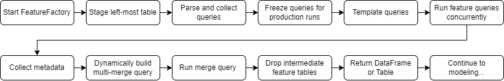

Coldstart is a package for automatic data collection and feature engineering that should be used by new and seasoned data scientists/engineers interested in accelerating model development.

Data collection and feature engineering are among the most tedious and time-consuming steps in the data science workflow. Coldstart aims to solve this problem by encapsulating efficient patterns and abstracting away low-level details associated with dynamic query templating, query optimization, concurrent execution, memory management, data leakage, and pipeline deployment.

Coldstart is meant to be a "Goldilocks" solution that sits somewhere between a collection of version-controlled queries and a full-fledged feature store. If you're making batch predictions that do not require ultra-low latency guarantees or if you're not taking full advantage of the warehouse’s available computing resources (i.e., waiting for queries dozens of queries to run one-by-one), then this package might be perfect for you.

Coldstart embraces a code that writes code mindset by exposing a powerful class (`FeatureFactory`) that retrieves data from various user-defined domains by establishing 1:1 or 1:M relationships with peer-reviewed queries that are templated at runtime based on user input and executed concurrently in one or many batches. The output comes in the form of a single wide dataframe that can be held in memory (i.e., pandas) or on disk (i.e., dask) and then fed directly into a feature engineering/modeling pipeline (e.g., sklearn). Row-level observations are identifiable through the use of composite indexes that have two parts to them: an entity component and a temporal component, which satisfy most tabular supervised ML use cases. When it's time to move from development to production, a user can "freeze" the queries that they will be using in their prediction pipeline.

The general order of events looks like this:

<div style="text-align:center"></div>

## Documentation

[Documentation](https://sturdy-robot-8dd63740.pages.github.io/) is hosted on GitHub Pages.

## Installation

The latest version can be installed from PyPI:

```bash
pip install coldstart
```

## Usage

Here is a basic example of how to use `FeatureFactory`:

```python
from coldstart import FeatureFactory

# Instantiate FeatureFactory
ff = FeatureFactory()

# List available query domains
my_domains = ff.list_domains(
    dialect='bigquery',
    entity_id='team_id' # replace with your entity_id
)
print(f'Available domains: {my_domains}')

# Set database spec
db_spec = {
    'dialect': 'bigquery',
    'project_id': PROJECT_ID, # replace with your project if using Big Query
    'schema': 'my_schema' # replace with your schema/dataset
}

# Start engine
ff.start_engine(db_spec)

# Run feature_factory
ff.run(
    leftmost_table='my_schema.my_leftmost_table', # table with columns: team_id and y
    feature_table='my_schema.my_feature_table',
    entity_id='team_id',
    domains=my_domains,
    date_range=['2010-01-01', '2015-01-01'],
)

# Return dataframe
features_df = ff.get_dataframe()

# Stop engine
ff.stop_engine()

# View dataframe
features_df.head()
```

See [this notebook](examples/Quickstart.ipynb) for a more thorough example.

Note that `my_schema.my_leftmost_table` must be a predefined table with at least 2 columns: `entity_id` and `y` where entity_id is corresponds with the tagged queries in the query bank and y corresponds with the dependent variable that you're eventually modeling. Optionally, you can also include a `min_date` and a `max_date` column so that each row is parameterized accordingly (if you do not include dates in your table, the `date_range` argument will be used for all records). A typical `leftmost_table` will look like this:

entity_id|y
---|---
abc|0
def|1
...|...

Or:

entity_id|y|min_date|max_date
---|---|---|---
abc|0|2020-01-01|2020-12-31
abc|1|2021-01-01|2021-12-31
def|0|2020-01-01|2020-12-31
def|1|2021-01-01|2021-12-31
...|...|...|...

Queries in the query bank must adhere to an established pattern. It's this pattern that makes consistent dynamic runtime templating possible. All queries must:

- Have a unique file name
    > **Tip**: By beginning the file name with the corresponding entity and domain name, you will easily be able to estasblish feature lineage back to the query because the final table appends the query name to the column name to ensure uniqueness 
- Be tagged with `DIALECT`, `ENTITY`, and `DOMAIN`
- Use the default `idx` column (which is a concatonation of `entity_id` + `min_date` + `max_date`) in the **SELECT** in all CTEs/subqueries and the outer-most query
    > **Tip**: You do not need to carry the `entity_id`, `min_date`, or `max_date` down through CTEs/subqueries because it is baked into `idx`
- Use the `{LEFTMOST_TABLE}` variable as the left-most table in the **FROM**
- Use `min_date` and `max_date` to constrain relevant date columns in the **WHERE** if dates are involved
- Have an outer-most query that uses `idx` in the **GROUP BY** if aggregation is involved

A typical query (e.g., `teamGameStats.sql`) will look something like this:

```sql
-- DIALECT: your_dialect (e.g., bigquery)
-- ENTITY: your_entity_id (e.g., team_id)
-- DOMAIN: your_domain (e.g., game)
WITH T1 AS (
    SELECT
        LMT.idx,
        A.some_column,
        B.some_other_column,
        ...
    FROM
        {LEFTMOST_TABLE} AS LMT
        INNER JOIN some_schema.some_table_1 AS A
            ON LMT.team_id = A.team_id
        LEFT JOIN some_schema.some_table_2 AS B
            ON A.id = B.team_id
        ...
    WHERE
        some_date_column >= LMT.min_date
        AND some_date_column <= LMT.max_date
        ...
)
SELECT
    T1.idx,
    SUM(T1.some_column) AS some_sum,
    SUM(T1.some_other_column) AS some_other_sum,
    ...
FROM
    T1
GROUP BY
    T1.idx
```

If you're looking for more fine-grained control over which queries to run, you can use the `queries` parameter, as opposed to the `domains` parameter. Before doing so though, you'll need to familiarize yourself with the queries in the query bank.

After running, you should get back a table/dataframe that is as wide as the total number of columns returned in all underlying queries' outer-most SELECT (plus `idx` and `y`). Building off of the earlier example, the `feature_table` and/or returned dataframe would look like this:

idx|y|teamGameStats_some_sum|teamGameStats_some_other_sum|...
---|---|---|---|---
abc_2010-01-01_2015-01-01|0|50|100|...
def_2010-01-01_2015-01-01|0|25|200|...
...|...|...|...|...

Which can then be passed into a boilerplate pipeline like this:

```python
from sklearn.pipeline import Pipeline
from sklearn.compose import ColumnTransformer, make_column_selector
from sklearn.ensemble import RandomForestClassifier
from sklearn.impute import SimpleImputer
from sklearn.preprocessing import OneHotEncoder, StandardScaler
from sklearn.model_selection import train_test_split

# Construct pipeline
numeric_transformer = Pipeline(
    steps=[
        ('imputer', SimpleImputer(strategy='constant', fill_value=0, copy=False)),
        ('scaler', StandardScaler()),
    ]
)
categorical_transformer = Pipeline(
    steps=[
        ('imputer', SimpleImputer(strategy='constant', fill_value='NA', copy=False)),
        ('encoder', OneHotEncoder(sparse=False, handle_unknown='ignore')),
    ]
)
preprocessor = ColumnTransformer(
    transformers=[
        ('num', numeric_transformer, make_column_selector(dtype_include=np.number)),
        ('cat', categorical_transformer, make_column_selector(dtype_include=pd.CategoricalDtype)),
    ]
)
pipe = Pipeline(
    steps=[
        ('preprocessor', preprocessor), 
        ('classifier', RandomForestClassifier()),
    ]
)

# Set features and class label
X = features_df.iloc[:, 1:]
y = features_df.iloc[:, 0]

# Train test split
X_train, X_test, y_train, y_test = train_test_split(X, y)

# Fit pipeline
pipe.fit(X_train, y_train)
```

Again, see [this notebook](examples/Quickstart.ipynb) for a more thorough example.

## Features Under Development

- Switch for writing intermediate results to Parquet files
- Option to return Dask DataFrame
- Testing for more databases
- Retrying decorator for run_query

## Contributor Guide

1. Before contributing to this CVS Health sponsored project, you will need to sign the associated [Contributor License Agreement](https://forms.office.com/r/HvYxTheDG5).
2. See [contributing](CONTRIBUTING.md) page.
